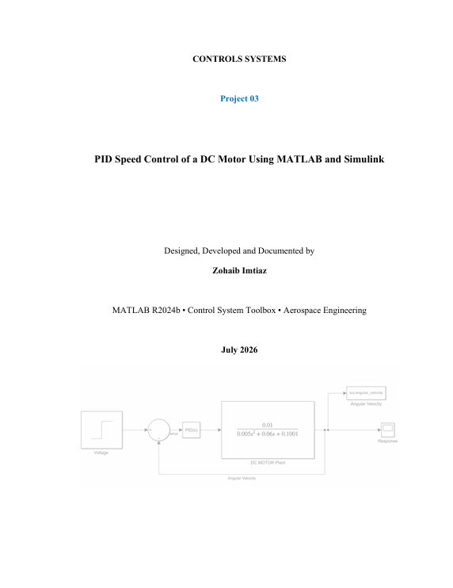

# PID Speed Control of a DC Motor Using MATLAB and Simulink

**Classical Control Systems | PID Controller | MATLAB | Simulink | Aerospace Engineering**

This repository contains my third independent control systems project, focusing on the design, tuning, and analysis of a PID feedback controller for a DC motor speed control system using MATLAB and Simulink.

---

## Overview

Project 03 marks the transition from system analysis to controller design. In Projects 01 and 02, the goal was to understand how systems behave. In Project 03, the goal becomes making the system behave the way we want.

The open-loop DC motor from Project 02 reached only 0.0998 rad/s for a 1 V input — a steady-state error of over 90%. This project systematically designs a closed-loop PID controller that drives the motor to exactly the commanded speed, rejects external disturbances, and meets all four performance targets: rise time under 1 second, settling time under 3 seconds, overshoot below 5%, and zero steady-state error.

Each control action — Proportional, Integral, and Derivative — was studied individually before combining them, so the physical contribution of each term is understood rather than assumed.

---

## Engineering Problem

Imagine designing a speed controller for an aircraft elevator actuator motor.

The pilot commands the elevator to move. The actuator motor must:
- Reach the commanded speed quickly
- Not overshoot the target position
- Settle without oscillation
- Maintain commanded speed despite aerodynamic disturbances

The open-loop motor from Project 02 cannot guarantee any of these requirements. This project builds the controller that can.

---

## What I Learned

- Why feedback is necessary and why unity feedback alone does not fix steady-state error
- How proportional control reduces error but cannot eliminate it
- How integral control eliminates steady-state error through accumulated correction
- What integrator windup is and why it causes overshoot at high Ki
- How derivative control acts as a predictive brake to reduce overshoot
- Why excessive Kd causes over-braking and paradoxically increases settling time
- How to tune PID gains systematically using a predict-simulate-explain methodology
- How automatic pidtune() compares to manual tuning and when each is appropriate
- How a tuned PID controller rejects external disturbances and returns to exact reference speed

---

## Simulink Blocks Used

- Step Input
- Sum Block
- Gain Block
- PID Controller Block
- Transfer Function Block
- To Workspace Block
- Scope
- Mux Block

---

## Controller Design Results

### Final Tuned PID: Kp = 10, Ki = 20, Kd = 0.1

| Metric | Result | Target | Status |
|---|---|---|---|
| Rise Time | 0.91 s | < 1 s | ✅ PASS |
| Settling Time | 2.60 s | < 3 s | ✅ PASS |
| Overshoot | 0.009% | < 5% | ✅ PASS |
| Steady-State Error | 0% | 0% | ✅ PASS |

---

## Complete Controller Comparison

| Controller | Rise Time | Settling Time | Overshoot | SS Error |
|---|---|---|---|---|
| Open Loop | 1.14 s | 3.07 s | 0% | 90.02% |
| Closed Loop — Unity Feedback | 1.03 s | 2.85 s | 0% | 90.92% |
| P only (Kp=10) | 0.50 s | 1.84 s | 0.006% | 50.02% |
| PI (Kp=10, Ki=20) | 0.89 s | 2.60 s | ~0% | 0% |
| PD (Kp=10, Kd=0.1) | 0.50 s | 1.85 s | 0.001% | 50.02% |
| **PID (Kp=10, Ki=20, Kd=0.1)** | **0.91 s** | **2.60 s** | **0.009%** | **0%** |

---

## Manual vs Automatic Tuning

| | Kp | Ki | Kd | Rise Time | Settling Time | Overshoot | SS Error |
|---|---|---|---|---|---|---|---|
| Manual Tuning | 10 | 20 | 0.1 | 0.91 s | 2.60 s | 0.009% | 0% |
| pidtune() Auto | 19.5 | 53 | 1.57 | 0.46 s | 1.60 s | 6.39% | 0% |

**Key insight:** Automatic tuning is twice as fast but carries 6.39% overshoot. For aerospace actuator applications where overshoot means a control surface moving past its commanded position, the manual tune is the correct engineering choice.

---

## P Controller Study (Kp Variation)

| Kp | Rise Time | Settling Time | Overshoot | Steady-State Speed |
|---|---|---|---|---|
| 0.5 | 1.08 s | 2.96 s | 0% | 0.0476 rad/s |
| 1 | 1.03 s | 2.85 s | 0% | 0.0908 rad/s |
| 5 | 0.71 s | 2.26 s | 0% | 0.3331 rad/s |
| 10 | 0.50 s | 1.84 s | 0.006% | 0.4998 rad/s |
| 50 | 0.17 s | 1.53 s | 12.79% | 0.9398 rad/s |

---

## PI Controller Study (Ki Variation, Kp=10)

| Ki | Rise Time | Settling Time | Overshoot | SS = 1.0? |
|---|---|---|---|---|
| 1 | 11.92 s | 18.40 s | 0% | No — 0.809 |
| 5 | 5.70 s | 12.37 s | 0% | Almost — 0.997 |
| 10 | 2.52 s | 6.32 s | 0% | Yes — 1.000 |
| 20 | 0.89 s | 2.60 s | ~0% | Yes — 1.000 |
| 30 | 0.58 s | 2.99 s | 6.40% | Yes but overshoots |
| 50 | 0.41 s | 3.37 s | 21.41% | Yes but badly overshoots |

---

## PD Controller Study (Kd Variation, Kp=10)

| Kd | Rise Time | Settling Time | Overshoot |
|---|---|---|---|
| 0.01 | 0.493 s | 1.831 s | 0.007% |
| 0.05 | 0.497 s | 1.838 s | 0.003% |
| 0.10 | 0.502 s | 1.848 s | 0.001% |
| 0.50 | 0.529 s | 1.915 s | ~0% |
| 5.00 | 0.099 s | 1.168 s | 0.479% |
| 10.00 | 0.036 s | 3.145 s | 26.31% |

---

## Disturbance Rejection

A step disturbance was injected at the plant input at t=5s to simulate a sudden mechanical load on the motor — equivalent to an aircraft actuator suddenly encountering increased aerodynamic resistance.

| Condition | Speed Before | Speed After Disturbance | Final Speed | Recovery |
|---|---|---|---|---|
| No Disturbance | 1.000 rad/s | — | 1.000 rad/s | N/A |
| Disturbance = −0.5 | 1.000 rad/s | ~0.950 rad/s | 1.000 rad/s | ✅ Complete |
| Disturbance = +0.5 | 1.000 rad/s | ~1.020 rad/s | 1.000 rad/s | ✅ Complete |

The PID controller returned to exactly 1.0 rad/s in both cases. An open-loop system or P-only controller would have permanently settled at a different speed.

---

## Key Engineering Insights

**On P Control:**
P control reduces steady-state error but can never eliminate it. The residual error is a mathematical property of proportional control, not a tuning problem. No matter how high Kp is pushed, SSE remains nonzero for a step input.

**On Integral Windup:**
When Ki is too high, the integrator accumulates a large correction during the initial rise and cannot cancel it quickly when the output crosses the reference — causing overshoot before settling. This is called integrator windup and is a real concern in embedded aerospace controllers.

**On Derivative Over-Braking:**
Large Kd makes the controller hypersensitive to fast error changes. At Kd=10, the controller sees the step input as a massive error rate and applies enormous braking, slowing the initial response so severely that the system lurches and oscillates. D control is a brake, not an accelerator.

**On PID Gain Interdependence:**
The three gains are not independent. Increasing Kp allows increasing Ki without windup, but then requires increasing Kd to suppress the resulting oscillation. This is exactly why pidtune() uses Kp=19.5, Ki=53, Kd=1.57 — a balanced set, not three separately tuned values.

---

## Aerospace Connection

The disturbance rejection capability demonstrated in this project directly models:
- **Aircraft actuators** — rejecting aerodynamic load changes on control surfaces
- **UAV motors** — rejecting wind gust disturbances during hover
- **Satellite reaction wheels** — rejecting bearing friction disturbances to maintain exact spin rate
- **Rocket TVC actuators** — maintaining commanded gimbal angle despite aerodynamic side loads

The choice to prioritize manual tuning over automatic tuning — accepting slower response in exchange for zero overshoot — is the exact trade-off made by flight control engineers in safety-critical systems.

---


## Project Roadmap

```
✅ Project 01 — Mass-Spring-Damper Analysis
✅ Project 02 — DC Motor Modeling
✅ Project 03 — PID Speed Control ← YOU ARE HERE

→ Project 04 — Aircraft Pitch Control
→ Project 05 — Root Locus Design
→ Project 06 — Bode & Nyquist Analysis
→ Project 07 — State-Space Modeling
→ Project 08 — Pole Placement
→ Project 09 — LQR Optimal Control
→ Project 10 — Kalman Filter
→ Project 11 — UAV Attitude Control
→ Project 12 — Rocket Attitude Control
→ Project 13 — Satellite Attitude Control
→ Project 14 — Missile Guidance
→ Project 15 — Complete Flight Control System
```

---

## Software Used

- MATLAB R2024b
- Simulink
- Control System Toolbox

---

## Author

**Zohaib Imtiaz**
Aerospace Engineering Student

---

## License

This project is released under the MIT License.

## Project Cover




---


